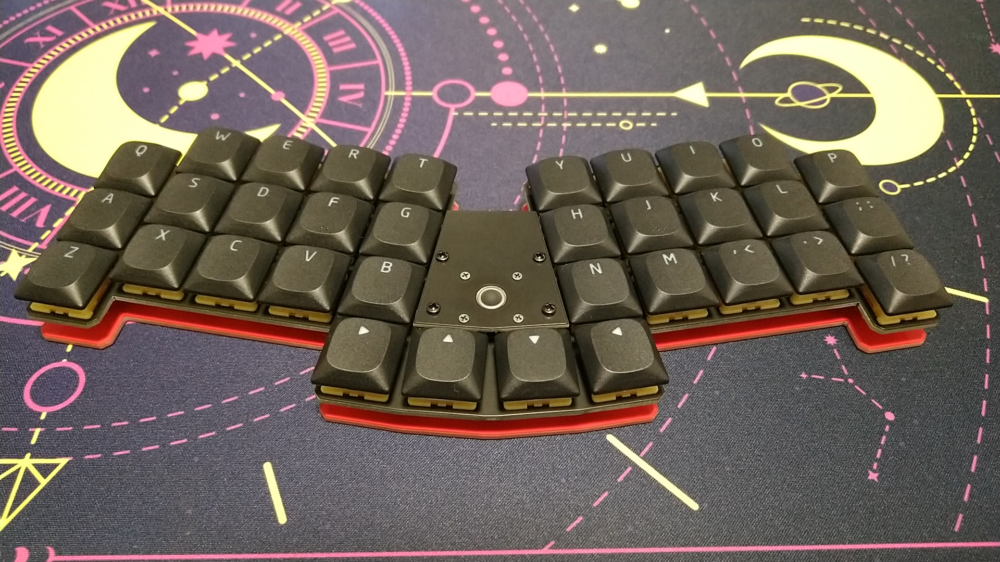

# EndZone34-plate

Original EndZone34: https://github.com/takashicompany/endzone34

## Dependency (FR4-Plate)
* [Salicylic-acid3/KiCAD_FootPrint](https://github.com/Salicylic-acid3/KiCAD_FootPrint)

## Notes
* All plates except the cover plate are designed for use with MX Switch Sockets.
Please note that the screw holes around the perimeter of the plate are omitted.