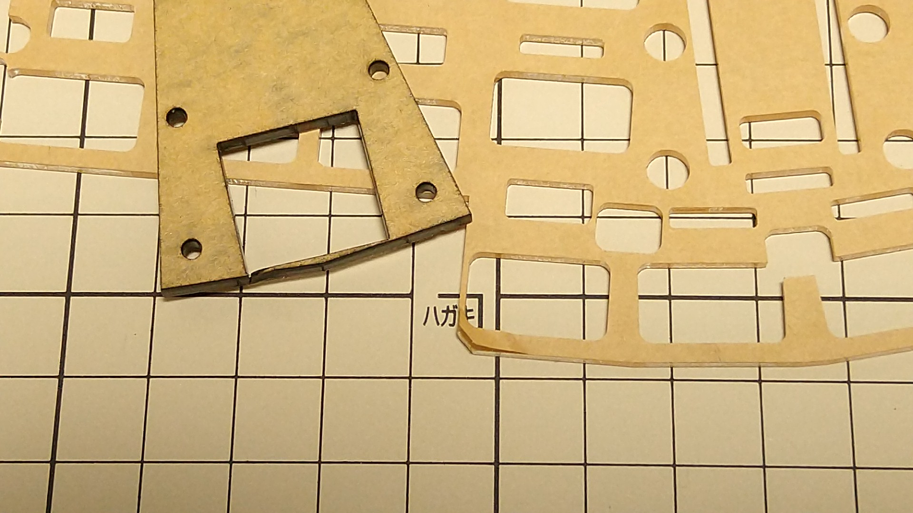

# EndZone34-plate_theme-plain

## Notes
* Middle plate 1 is used between the top plate and PCB, and middle plate 2 is used between PCB and bottom plate.
* Recommended thickness of middle plate: 3mm
  - Middle plate 2 can be used with a thickness of 2 mm, but rubber feet must be attached to the bottom plate or the reset switch must be removed.
  - Use a 3 mm or 2 mm middle plate for the cover plate, depending on the height of the gap.
* The middle plate has a narrow section that is easily damaged.

* When using FR4 top plate, it is recommended to insert a 0.5 mm silicone sheet between the top plate and the middle plate 1, since there will be a gap between the top plate and the middle plate.